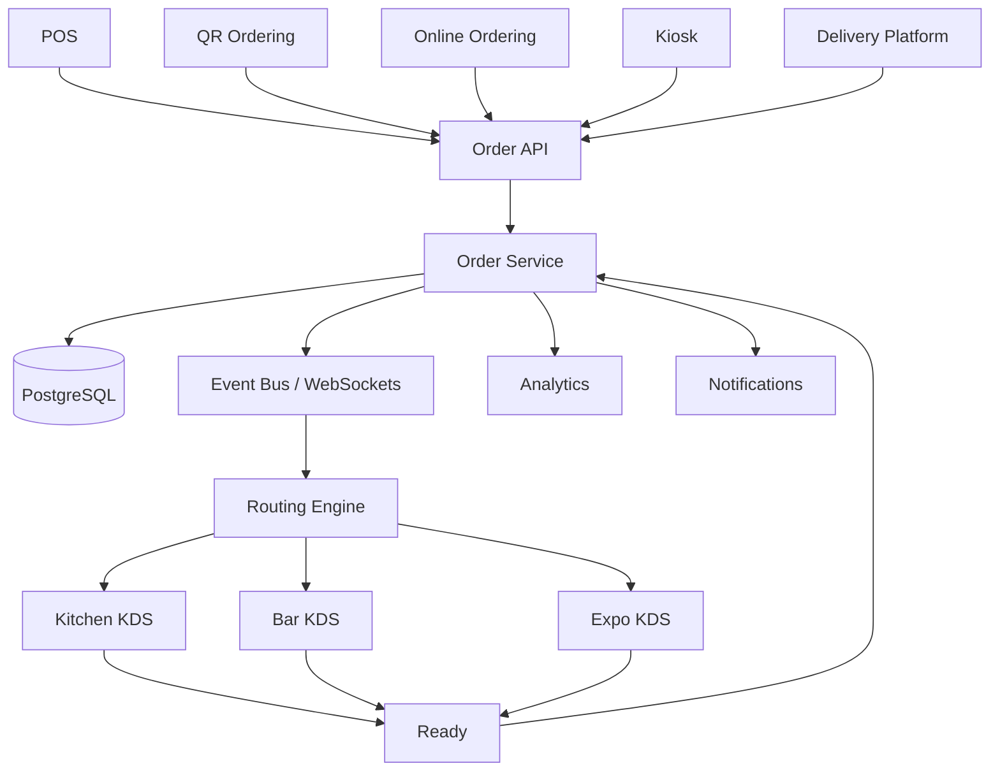
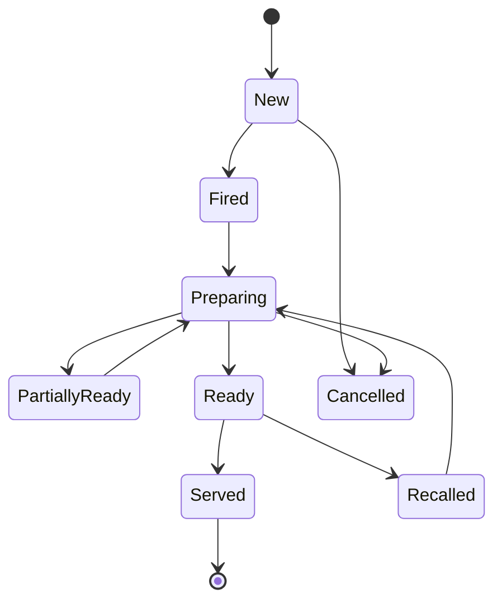
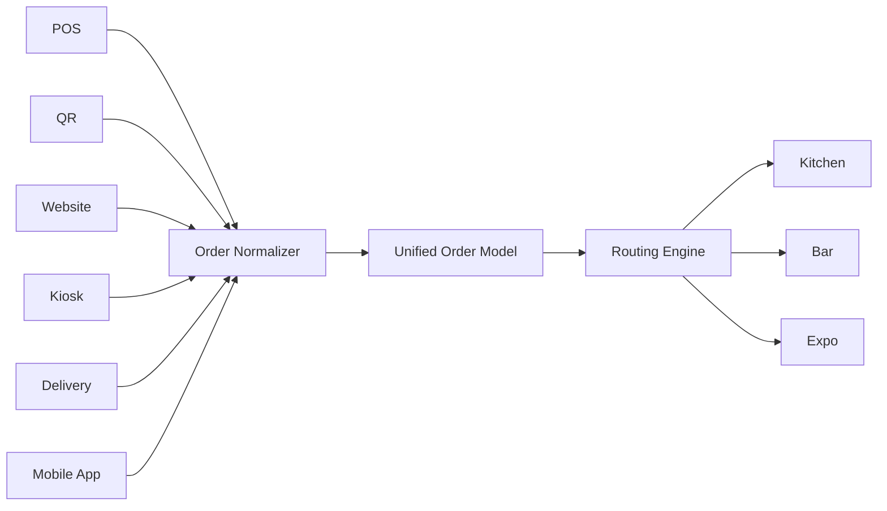

# Awesome-Restaurant-Kitchen-Display-System

# 🍳 Top Restaurant Kitchen Display Systems (KDS) & Open-Source Alternatives


> A curated list of **restaurant Kitchen Display Systems (KDS), digital kitchen management platforms, POS-integrated kitchen software and open-source/self-hostable KDS alternatives**.


A **Kitchen Display System (KDS)** replaces paper kitchen tickets with digital screens that receive orders from a restaurant POS, online ordering system, kiosk or delivery channel and guide kitchen staff through preparation.


Modern KDS platforms typically provide:


* Real-time order routing

* Kitchen stations

* Ticket management

* Item-level preparation status

* Order timers

* Color-coded tickets

* Modifiers and special instructions

* Course firing

* Expediter screens

* Bump / recall workflows

* Multi-station routing

* Kitchen performance analytics

* POS integration

* Online-order integration

* Offline/local-network resilience

* Kitchen printer integration


For example, Toast describes its KDS as a POS-connected system where orders appear on kitchen screens in real time, with prep-station routing, timers, production counts and kitchen productivity reporting.


This repository focuses primarily on **open-source and self-hostable alternatives**, while keeping commercial KDS products in a separate section.


> **Important:** There are relatively few mature open-source products dedicated exclusively to restaurant KDS. Consequently, the open-source section includes both dedicated KDS projects and broader open-source restaurant POS platforms that provide KDS functionality. This makes the list more useful for actually building a Toast/Square/Fresh-KDS-style system.


---


## 📑 Table of Contents


* [☁️ SaaS/Hosted Platforms](#️-saashosted-platforms)

* [🌍 Open-Source](#-open-source)

* [🍳 Open-Source Dedicated KDS](#-open-source-dedicated-kds)

* [🍽️ Open-Source Restaurant POS + KDS](#️-open-source-restaurant-pos--kds)

* [⚡ Real-Time KDS & WebSocket Projects](#-real-time-kds--websocket-projects)

* [🧾 Open-Source Kitchen Order Management](#-open-source-kitchen-order-management)

* [🖥️ Open-Source POS Platforms with Kitchen Workflows](#️-open-source-pos-platforms-with-kitchen-workflows)

* [🖨️ Open-Source Kitchen Printing](#️-open-source-kitchen-printing)

* [📱 Open-Source Self-Ordering + KDS](#-open-source-self-ordering--kds)

* [📊 Open-Source Kitchen Analytics](#-open-source-kitchen-analytics)

* [🔌 Open-Source Restaurant Integrations](#-open-source-restaurant-integrations)

* [🧩 Commercial Platform → Open-Source Equivalent](#-commercial-platform--open-source-equivalent)

* [🏗️ KDS Architecture](#️-kds-architecture)

* [🔄 Open-Source KDS Architecture](#-open-source-kds-architecture)

* [🍳 Multi-Station Kitchen Architecture](#-multi-station-kitchen-architecture)

* [⏱️ Kitchen Timing & Bump Workflow](#️-kitchen-timing--bump-workflow)

* [🔀 Order Routing Architecture](#-order-routing-architecture)

* [⚖️ Commercial vs Open-Source](#️-commercial-vs-open-source)

* [🚀 Recommended Open-Source Stacks](#-recommended-open-source-stacks)

* [📊 KDS Technology Comparison](#-kds-technology-comparison)

* [🎯 Recommended Projects by Use Case](#-recommended-projects-by-use-case)

* [🏢 Building a Toast KDS Alternative](#-building-a-toast-kds-alternative)

* [🏗️ Building an Open-Source KDS](#️-building-an-open-source-kds)

* [🌐 Open-Source KDS Landscape](#-open-source-kds-landscape)

* [🧠 Why Open-Source KDS Matters](#-why-open-source-kds-matters)

* [🤝 Contributing](#-contributing)

* [⚠️ Disclaimer](#️-disclaimer)


---


# ☁️ SaaS/Hosted Platforms


Commercial KDS platforms generally integrate directly with a restaurant POS and provide a managed combination of software, hardware, routing, reporting and support.


| Platform | Company | Primary Focus | Key Capabilities | Pricing | Free Tier Limits |
| --- | --- | --- | --- | --- | --- |
| [Toast KDS](https://pos.toasttab.com/hardware/kitchen-display-system) | Toast | Integrated restaurant KDS | Real-time tickets, prep stations, expediter workflows, timers and kitchen reporting | Starting at $25/screen/month (Hardware from $499; POS core starting at $0/month via pay-as-you-go) | No free tier or trial (Live demo available; 0 days free trial) |
| [Square KDS](https://squareup.com/us/en/hardware/kitchen-display-system) | Block / Square | POS-integrated KDS | Digital tickets, order tracking and kitchen workflows | Starting at $20/device/month (Requires Square for Restaurants; free standard POS app available) | 30-day free trial (Full KDS features with unlimited tickets for 30 days) |
| [Lightspeed KDS](https://www.lightspeedhq.com/) | Lightspeed | Restaurant KDS | Digital tickets, kitchen routing and POS integration | Starting at $30/screen/month (Requires Lightspeed Restaurant POS base plan starting at $69/month) | 30-day free trial (Full access to KDS routing and display features for 30 days) |
| [TouchBistro KDS](https://www.touchbistro.com/) | TouchBistro | Restaurant KDS | Kitchen workflow and POS integration | Starting at $19/screen/month (Base TouchBistro POS subscription starting at $69/month) | No free tier or trial (Guided product demo only; 0 days free trial) |
| [Oracle MICROS KDS](https://www.oracle.com/food-beverage/restaurant-pos-systems/kds-kitchen-display-systems/) | Oracle | Enterprise restaurant KDS | Station routing, timed preparation, real-time POS updates and kitchen workflows | Starting at $55/workstation/month (Oracle Simphony Essentials tier; enterprise hardware quoted separately) | No free tier or trial (Interactive virtual product tour and demo only; 0 days free trial) |
| [Fresh KDS](https://www.fresh.technology/) | Fresh Technology | Standalone / integrated KDS | POS integrations, timers, modifiers, item completion and tablet-based KDS | Starting at $20/screen/month (Billed monthly; supports BYO iPad/Android hardware) | 7-day free trial (Full platform functionality without credit card requirement for 7 days) |
| [Syrve KDS](https://syrve.com/) | Syrve | Restaurant operations | KDS, restaurant POS, inventory and operational management | Starting at €39/terminal/month (approx. £49/month or 250 AED/month depending on region) | No free tier or trial (1-on-1 guided live demo only; 0 days free trial) |
| [Revel KDS](https://revelsystems.com/) | Revel Systems | Restaurant POS + KDS | Kitchen workflow and POS integration | Starting at $99/terminal/month (Base POS plan billed annually; KDS module quoted as add-on) | No free tier or trial (Live consultation and system demo only; 0 days free trial) |
| [SpotOn KDS](https://www.spoton.com/) | SpotOn | Restaurant operations | POS-connected kitchen workflows | Starting at $20/station/month ($500 one-time hardware fee; base POS starting at $99/month) | No free tier or trial (Custom demonstration only; 0 days free trial) |
| [CAKE KDS](https://trycake.com/) | PAR Technology / CAKE | Restaurant POS + KDS | Kitchen order management and restaurant operations | Starting at $69/month (CAKE POS Essentials tier; KDS hardware bundle quoted per station) | No free tier or trial (Tailored sales demo only; 0 days free trial) |
| [Clover KDS](https://www.clover.com/) | Fiserv | Restaurant POS ecosystem | POS and kitchen workflow integrations | Starting at $25/device/month (Official 14" hardware at $799; or free 3rd-party Simple KDS app on BYO tablet) | Free-forever tier available via third-party Simple KDS on Clover App Market (limited to basic BYO Android tablet ticket display); official Clover KDS has no free trial (0 days) |
| [Epson TrueOrder](https://epson.com/usa/kitchen-display-systems) | Epson | Kitchen display hardware/software | Digital kitchen tickets and restaurant workflows | $0/month recurring (One-time perpetual software license bundled with hardware purchase, approx. $500–$800/station) | No free trial (Zero monthly recurring fees; requires purchase of pre-licensed hardware station) |
| [NCR Voyix](https://www.ncrvoyix.com/) | NCR Voyix | Enterprise restaurant technology | POS, kitchen and restaurant operations | Starting at $89/month (Aloha Cloud Starter tier including kitchen routing; terminal leasing options available) | No free tier or trial (Sales consultation and guided product demo only; 0 days free trial) |
| [PAR Brink](https://partech.com/) | PAR Technology | Enterprise restaurant technology | POS, kitchen and restaurant operations | Starting at $90/terminal/month (Monthly SaaS model for enterprise restaurant chains) | No free tier or trial (Guided product demo only; 0 days free trial) |
| [Qu KDS](https://www.qubeyond.com/) | Qu | QSR technology | POS, kitchen and digital restaurant workflows | Starting at $100/terminal/month (Enterprise commerce platform designed for multi-unit brands with 20+ stores) | No free tier or trial (Enterprise architecture assessment and demo only; 0 days free trial) |
| [Deliverect KDS](https://www.deliverect.com/) | Deliverect | Digital ordering | Aggregated delivery/order workflows and kitchen operations | Starting at $69/month (Deliverect core ordering aggregation tier starting at 350 orders/month; KDS module available as add-on) | No free tier or trial (1-on-1 guided product demo only; 0 days free trial) |
| [Otter](https://www.tryotter.com/) | Otter | Restaurant order management | Order aggregation, POS integrations and kitchen workflow | Starting at $15/device/month for KDS add-on (Base restaurant order aggregation package starting at $79/month) | No free tier or trial (Free mobile management app Otter Go available for active subscribers; 0 days free trial) |
| [Chowly](https://chowly.com/) | Chowly | Restaurant integrations | Online-order aggregation and POS/KDS workflows | Starting at $99/month (Month-to-month subscription with no long-term contracts; includes order integration) | Promotional 90-day free trial on first 3 months (Limited to promotional signups with 6-month growth guarantee; otherwise 0 days standard trial) |


Toast's current KDS supports prep-station and expediter configurations, item-level fulfillment, timers, production counts and kitchen productivity reporting.


Fresh KDS is designed to run on tablets and integrates with numerous restaurant POS and online-ordering platforms, including Square, Clover, TouchBistro, Lightspeed, SpotOn and others.


Oracle's KDS emphasizes station workflows, color-coded orders, predefined cook timings and real-time updates from POS, web and mobile ordering.


---


# 🌍 Open-Source


The open-source KDS ecosystem is smaller than the commercial ecosystem, but there are several useful approaches.


```text

                         OPEN-SOURCE KDS

                               │

          ┌────────────────────┼────────────────────┐

          │                    │                    │

          ▼                    ▼                    ▼

     Dedicated KDS       Restaurant POS        Components

          │                    │                    │

          ▼                    ▼                    ▼

       OpenKDS             FloreantPOS        WebSockets

       KDS Apps            Restro             SQLite

       kitchenOS           Openfront          PostgreSQL

                           Tavo POS

                               │

                               ▼

                        Kitchen Workflow

```


The strongest open-source approach is often to combine:


```text

Restaurant POS

      +

Order Management

      +

Real-Time Event Bus

      +

KDS UI

      +

Station Routing

      +

Kitchen Analytics

      +

Printer / Hardware Layer

```


---


# 🍳 Open-Source Dedicated KDS


## OpenKDS


[OpenKDS](https://github.com/BenClementt/OpenKDS) is one of the clearest examples of a dedicated open-source Kitchen Display System.


It provides:


* POS integration

* KDS API

* Web UI

* Kitchen stations

* Order display

* Node.js backend

* Browser-based kitchen interface


The project describes itself as an open-source KDS designed to work with restaurant POS systems and exposes API and Web UI functionality. It is licensed GPL-3.0.


| Project                                                  | Focus                             | License        |

| -------------------------------------------------------- | --------------------------------- | -------------- |

| [OpenKDS](https://github.com/BenClementt/OpenKDS)        | Dedicated restaurant KDS          | GPL-3.0        |

| [KDS App](https://github.com/zhameersheraz/kds-app)      | POS + real-time KDS               | See repository |

| [kitchenOS](https://github.com/rajeshselvam02/kitchenOS) | KDS + order ingestion + inventory | See repository |

| [KDS-1](https://github.com/richi010384/KDS-1)            | Kitchen Display System            | See repository |


---


## KDS App


[KDS App](https://github.com/zhameersheraz/kds-app) is a small restaurant POS/KDS application built around real-time order communication.


Its architecture includes:


```text

POS

 │

 ├── Express

 ├── Socket.IO

 └── SQLite

       │

       ▼

      KDS

```


The project provides POS, KDS and administration screens, with real-time Socket.IO order/status updates and separate kitchen workflow states.


---


## kitchenOS


[kitchenOS](https://github.com/rajeshselvam02/kitchenOS) is an open-source restaurant-kitchen project centered around:


* Order ingestion

* WebSocket KDS

* Inventory

* BOM-based deduction

* Low-stock alerts

* Audit logging


Its architecture separates ingestion, KDS and inventory services and uses PostgreSQL/TimescaleDB.


```text

Order Sources

     │

     ▼

 Ingestion API

     │

     ▼

 WebSocket

     │

     ▼

    KDS

     │

     ▼

 Inventory

```


---


# 🍽️ Open-Source Restaurant POS + KDS


Many of the most useful open-source KDS alternatives are actually complete restaurant-management platforms.


| Project                                                                     | POS |        KDS       | Tables | Inventory | Ordering |

| --------------------------------------------------------------------------- | :-: | :--------------: | :----: | :-------: | :------: |

| [FloreantPOS](https://github.com/Jabro/floreantpos)                         |  ✅  | Kitchen workflow |    ✅   |     ✅     |     ✅    |

| [ElitaleRestro](https://github.com/elitale/restro)                          |  ✅  |         ✅        |    ✅   |     ✅     |     ✅    |

| [Openfront Restaurant](https://github.com/openshiporg/openfront-restaurant) |  ✅  |         ✅        |    ✅   |     —     |     ✅    |

| [Tavo POS](https://github.com/sanjayubhrani-lab/tavo-pos)                   |  ✅  |         ✅        |    ✅   |     —     |     —    |

| [Satisfecho POS](https://github.com/satisfecho/pos)                         |  ✅  |         ✅        |    ✅   |     ✅     |     ✅    |

| [Restaurant POS](https://github.com/iono-such-things/restaurant-pos-system) |  ✅  |         ✅        |    ✅   |     ✅     |     —    |

| [DittoPOS](https://github.com/getditto/demoapp-pos-kds)                     |  ✅  |         ✅        |    —   |     —     |     —    |

| [FloCafe](https://github.com/FreeOpenSourcePOS/FloCafe)                     |  ✅  | Kitchen-oriented |    —   |     —     |     ✅    |


[FloreantPOS](https://github.com/Jabro/floreantpos) is an established open-source restaurant POS project focused on order management, restaurant operations and kitchen automation.


---


# 🍽️ ElitaleRestro


[ElitaleRestro](https://github.com/elitale/restro) is an open-source restaurant management platform covering:


* POS

* Kitchen display

* Orders

* Tables

* Inventory

* Recipe-based stock depletion

* GST-aware billing

* Staff management

* Analytics

* QR self-ordering


It is therefore closer to a complete open-source restaurant operating system than a standalone KDS.


---


# 🏪 Openfront Restaurant


[Openfront Restaurant](https://github.com/openshiporg/openfront-restaurant) provides a broader restaurant platform including:


* POS

* KDS

* Table management

* Menu management

* Waitlists

* Real-time synchronization

* Restaurant workflows


It is useful when the goal is to build something closer to a **Toast-style restaurant platform** rather than merely replacing the kitchen screen.


---


# ⚡ Real-Time KDS & WebSocket Projects


Real-time communication is one of the most important technical requirements of a KDS.


```text

                POS

                 │

                 │ Order Created

                 ▼

           Event / WebSocket

                 │

       ┌─────────┼─────────┐

       ▼         ▼         ▼

    Grill      Fryer     Drinks

       │         │         │

       ▼         ▼         ▼

     Ready     Ready      Ready

       │         │         │

       └─────────┼─────────┘

                 ▼

              Expediter

```


Useful open-source projects include:


| Project                                                                            | Real-Time Technology      |

| ---------------------------------------------------------------------------------- | ------------------------- |

| [KDS App](https://github.com/zhameersheraz/kds-app)                                | Socket.IO                 |

| [kitchenOS](https://github.com/rajeshselvam02/kitchenOS)                           | WebSockets                |

| [Restaurant POS System](https://github.com/iono-such-things/restaurant-pos-system) | WebSockets                |

| [Satisfecho POS](https://github.com/satisfecho/pos)                                | WebSockets                |

| [Tasty Station POS](https://github.com/hey-Zayn/Tasty-Station-POS)                 | Socket.IO                 |

| [DittoPOS](https://github.com/getditto/demoapp-pos-kds)                            | Real-time synchronization |

| [Openfront Restaurant](https://github.com/openshiporg/openfront-restaurant)        | Real-time synchronization |


For example, the Tasty Station project uses Socket.IO to push orders to kitchen displays and synchronize order-state changes with front-of-house screens.


---


# 🧾 Open-Source Kitchen Order Management


A KDS is fundamentally an **order-state management system**.


A useful state machine is:


```text

               ┌──────────────┐

               │    NEW       │

               └──────┬───────┘

                      │

                      ▼

               ┌──────────────┐

               │   ACCEPTED  │

               └──────┬───────┘

                      │

                      ▼

               ┌──────────────┐

               │  PREPARING   │

               └──────┬───────┘

                      │

                      ▼

               ┌──────────────┐

               │    READY     │

               └──────┬───────┘

                      │

                      ▼

               ┌──────────────┐

               │   PICKED UP  │

               └──────────────┘

```


Additional states can include:


```text

NEW

MODIFIED

VOIDED

HELD

FIRED

PREPARING

PARTIALLY_READY

READY

RECALLED

SERVED

CANCELLED

```


---


# 🖥️ Open-Source POS Platforms with Kitchen Workflows


## FloreantPOS


[FloreantPOS](https://github.com/Jabro/floreantpos) is one of the longer-standing open-source restaurant POS projects.


Features include:


* Restaurant POS

* Order management

* Table service

* Kitchen workflows

* Multiple-terminal architecture

* Printing

* Restaurant reporting

* Inventory-related functionality


The project describes itself as a free/open-source restaurant POS and emphasizes order management and kitchen automation.


---


## Satisfecho POS


[Satisfecho POS](https://github.com/satisfecho/pos) is a self-hosted restaurant platform featuring:


* POS

* Menu

* Tables

* Reservations

* Payments

* Kitchen display

* Reports

* Multi-tenant architecture

* Real-time order updates


Its repository describes a self-hosted, multi-tenant restaurant POS with a dedicated `/kitchen` view and WebSocket-based order status updates.


---


## Tavo POS


[Tavo POS](https://github.com/sanjayubhrani-lab/tavo-pos) is a self-hostable restaurant POS with:


* Order taking

* Modifiers

* Table/floor management

* Live KDS

* Tips

* Split-friendly payments

* Receipts

* Menu management

* Staff management

* Sales dashboard


The project positions itself as a Toast-style restaurant POS that can be run on your own infrastructure.


---


# 🖨️ Open-Source Kitchen Printing


Even restaurants using KDS often maintain kitchen printers as:


* Backup

* Expo printer

* Bar printer

* Receipt printer

* Offline fallback


Useful open-source technologies include:


| Project / Technology                                                       | Purpose                        |

| -------------------------------------------------------------------------- | ------------------------------ |

| [FloreantPOS](https://github.com/Jabro/floreantpos)                        | Restaurant printing            |

| [ESC/POS](https://github.com/python-escpos/python-escpos)                  | Thermal printer protocol       |

| [python-escpos](https://github.com/python-escpos/python-escpos)            | ESC/POS printing               |

| [node-thermal-printer](https://github.com/Klemen1337/node-thermal-printer) | Node.js thermal printing       |

| [QZ Tray](https://github.com/qzind/tray)                                   | Browser-to-printer integration |

| CUPS                                                                       | Linux printing infrastructure  |


A common architecture is:


```text

POS

 │

 ▼

Order Router

 │

 ├────► KDS

 │

 ├────► Kitchen Printer

 │

 ├────► Bar Printer

 │

 └────► Expo Printer

```


---


# 📱 Open-Source Self-Ordering + KDS


Modern restaurant systems increasingly combine:


```text

QR Ordering

     │

     ▼

Online Ordering

     │

     ▼

POS

     │

     ▼

KDS

     │

     ├── Kitchen

     ├── Bar

     └── Expo

```


Useful open-source platforms include:


| Project                                                                     | Self Ordering | KDS |

| --------------------------------------------------------------------------- | :-----------: | :-: |

| [ElitaleRestro](https://github.com/elitale/restro)                          |      ✅ QR     |  ✅  |

| [Openfront Restaurant](https://github.com/openshiporg/openfront-restaurant) |       ✅       |  ✅  |

| [Satisfecho POS](https://github.com/satisfecho/pos)                         |      ✅ QR     |  ✅  |

| [Baresto Manager](https://github.com/atzounis/baresto_manager)              |      ✅ QR     |  ✅  |

| [Restaurant POS](https://github.com/iono-such-things/restaurant-pos-system) |       —       |  ✅  |


[Baresto Manager](https://github.com/atzounis/baresto_manager) combines waiter ordering, table management, QR menus and a real-time kitchen display.


---


# 📊 Open-Source Kitchen Analytics


One of the major advantages of digital KDS over paper tickets is that every kitchen event can become structured operational data.


```text

Order Created

     │

     ▼

Order Fired

     │

     ▼

Item Started

     │

     ▼

Item Ready

     │

     ▼

Order Ready

     │

     ▼

Order Served

```


From this, the system can calculate:


| Metric              | Description                 |

| ------------------- | --------------------------- |

| Ticket Time         | Order fired → ready         |

| Prep Time           | Item started → ready        |

| Queue Time          | Order created → preparation |

| Station Time        | Time spent at each station  |

| Bump Time           | Ticket appearance → bump    |

| Throughput          | Orders completed per hour   |

| SLA Breaches        | Orders exceeding target     |

| Station Utilization | Workload by station         |

| Peak Load           | Kitchen volume by time      |

| Item Bottleneck     | Slowest menu items          |

| Modifier Impact     | Effect of customizations    |

| Course Timing       | Course-to-course delay      |


---


# 🔌 Open-Source Restaurant Integrations


A modern KDS should ideally be able to receive orders from multiple channels.


```text

                         ORDER SOURCES

                              │

          ┌───────────────────┼───────────────────┐

          │                   │                   │

          ▼                   ▼                   ▼

         POS                QR Menu          Delivery

          │                   │                   │

          ▼                   ▼                   ▼

       ┌──────────────────────────────────────────┐

       │              ORDER SERVICE               │

       └──────────────────────┬───────────────────┘

                              │

                              ▼

                           KDS

```


Possible integrations include:


* POS

* QR ordering

* Website ordering

* Mobile app

* Self-service kiosk

* Delivery aggregators

* Online marketplaces

* Phone orders

* Catering systems

* Drive-through

* Bar ordering

* Table ordering


Fresh KDS demonstrates the importance of this integration layer by connecting to numerous POS and ordering platforms rather than functioning only as an isolated display.


---


# 🧩 Commercial Platform → Open-Source Equivalent


| Commercial KDS                | Open-Source Equivalent / Building Blocks                   |

| ----------------------------- | ---------------------------------------------------------- |

| **Toast KDS**                 | Openfront Restaurant + Satisfecho POS + OpenKDS            |

| **Square KDS**                | OpenKDS + Restaurant POS + WebSockets                      |

| **Lightspeed KDS**            | OpenKDS + POS + station routing                            |

| **TouchBistro KDS**           | ElitaleRestro + OpenKDS                                    |

| **Oracle MICROS KDS**         | Finer-grained POS + OpenKDS + real-time event architecture |

| **Fresh KDS**                 | OpenKDS + POS integrations + WebSockets                    |

| **Syrve KDS**                 | Openfront Restaurant + restaurant POS + inventory          |

| **Revel KDS**                 | Restaurant POS + OpenKDS                                   |

| **SpotOn KDS**                | Satisfecho POS + OpenKDS                                   |

| **CAKE KDS**                  | Openfront Restaurant + POS + KDS                           |

| **Clover KDS**                | OpenKDS + restaurant POS                                   |

| **Epson TrueOrder**           | Browser KDS + ESC/POS                                      |

| **Enterprise KDS**            | OpenKDS + WebSockets + PostgreSQL + Redis                  |

| **Standalone KDS**            | OpenKDS                                                    |

| **Toast-style Restaurant OS** | Openfront Restaurant / ElitaleRestro                       |

| **Small Restaurant KDS**      | KDS App / OpenKDS                                          |

| **Offline KDS**               | Local POS + SQLite + WebSocket / LAN                       |

| **Multi-station KDS**         | OpenKDS + routing engine + event bus                       |


---


# 🏗️ KDS Architecture


The basic KDS architecture is:


```text

                     ORDER SOURCE

                          │

                          ▼

                     ORDER API

                          │

                          ▼

                   ORDER DATABASE

                          │

                          ▼

                    EVENT BUS

                          │

          ┌───────────────┼───────────────┐

          ▼               ▼               ▼

       Kitchen           Bar             Expo

        KDS              KDS             KDS

          │               │               │

          └───────────────┼───────────────┘

                          ▼

                    Order Complete

```


---


# 🔄 Open-Source KDS Architecture





---


# 🍳 Multi-Station Kitchen Architecture


A sophisticated restaurant kitchen rarely has only one display.


```text

                         ORDER

                           │

                           ▼

                     Routing Engine

                           │

       ┌───────────────────┼───────────────────┐

       │                   │                   │

       ▼                   ▼                   ▼

     GRILL               FRYER              SALAD

       │                   │                   │

       ▼                   ▼                   ▼

    BURGER              FRIES             SALADS

       │                   │                   │

       └───────────────────┼───────────────────┘

                           ▼

                         EXPO

                           │

                           ▼

                         READY

```


For example:


```text

Order #1042


Burger × 2

Fries × 2

Caesar Salad × 1

Cola × 2

```


can become:


```text

GRILL

├── Burger × 2


FRYER

├── Fries × 2


COLD

├── Caesar Salad × 1


BAR

├── Cola × 2


EXPO

└── Wait for all stations

```


---


# ⏱️ Kitchen Timing & Bump Workflow


A KDS should track the entire lifecycle of an order.





A timer can be associated with every ticket:


```text

00:00  New

00:45  Fired

02:30  Preparing

07:15  Warning

10:00  SLA Breach

11:30  Ready

```


Typical visual states:


```text

🟢 Normal

🟡 Approaching target

🔴 Over target

```


---


# 🔀 Order Routing Architecture


Routing rules determine which kitchen station receives which item.


```text

             Menu Item

                 │

                 ▼

          Routing Rules

                 │

       ┌─────────┼─────────┐

       ▼         ▼         ▼

     Grill      Bar       Cold

       │         │         │

       ▼         ▼         ▼

    Station 1 Station 2 Station 3

```


Rules can be based on:


* Item

* Category

* Modifier

* Preparation method

* Restaurant location

* Order type

* Course

* Daypart

* Kitchen station

* Service mode

* Delivery channel


---


# 🧠 Course Firing


Advanced KDS platforms can coordinate courses.


```text

Order

 │

 ├── Starter

 │

 ├── Main

 │

 └── Dessert

```


Instead of sending everything immediately:


```text

STARTER

   │

   ▼

Prepared

   │

   ▼

Bump

   │

   ▼

MAIN FIRED

   │

   ▼

Prepared

   │

   ▼

Bump

   │

   ▼

DESSERT FIRED

```


This is particularly useful for table-service restaurants.


---


# 📦 Order Aggregation


A modern restaurant may receive:


```text

POS

QR

Website

App

Kiosk

Uber Eats

DoorDash

Deliveroo

Phone

```


A centralized KDS can normalize all of them:





---


# 📴 Offline-First KDS


Restaurant infrastructure should continue functioning when the internet disappears.


```text

                   INTERNET

                      │

                 ┌────┴────┐

                 │         │

               ONLINE    OFFLINE

                 │         │

                 ▼         ▼

              Cloud      Local LAN

                 │         │

                 └────┬────┘

                      ▼

                     POS

                      │

                      ▼

                     KDS

```


An ideal local fallback architecture:


```text

POS

 │

 ▼

Local SQLite

 │

 ▼

Local WebSocket

 │

 ▼

KDS

```


Cloud synchronization can occur later:


```text

Local Event Log

      │

      ▼

Cloud Sync

      │

      ▼

Central Database

```


---


# 📡 Real-Time Event Architecture


```text

OrderCreated

     │

     ├──► KDS

     ├──► Expo

     ├──► Bar

     ├──► Analytics

     └──► Customer Status


ItemStarted

     │

     ├──► KDS

     └──► Analytics


ItemReady

     │

     ├──► Expo

     └──► POS


OrderReady

     │

     ├──► POS

     ├──► Customer

     └──► Delivery

```


Possible technologies:


```text

WebSockets

Socket.IO

NATS

Redis Pub/Sub

Kafka

MQTT

Server-Sent Events

```


---


# ⚖️ Commercial vs Open-Source


| Capability           | Commercial KDS   | Open-Source KDS          |

| -------------------- | ---------------- | ------------------------ |

| Digital Tickets      | ✅                | ✅                        |

| POS Integration      | ✅                | ✅                        |

| Station Routing      | ✅                | ✅                        |

| Timers               | ✅                | ✅                        |

| Bump Workflow        | ✅                | ✅                        |

| Recall               | ✅                | ✅                        |

| Multi-Station        | ✅                | ✅                        |

| Course Firing        | ✅                | Build / varies           |

| Kitchen Analytics    | ✅                | Build / varies           |

| Offline Operation    | Often            | ✅ Possible               |

| Hardware             | Often included   | Choose yourself          |

| Thermal Printing     | ✅                | ✅                        |

| QR Ordering          | Often            | Build / integrate        |

| Delivery Integration | Often            | Build / integrate        |

| Multi-Location       | ✅                | Build / varies           |

| Support              | ✅                | Community / self-managed |

| Customization        | Limited          | Very High                |

| Source Code          | ❌                | ✅                        |

| Self Hosting         | Usually limited  | ✅                        |

| Data Ownership       | Vendor-dependent | Full control             |

| Vendor Lock-In       | Higher           | Lower                    |

| Monthly SaaS Cost    | Usually          | Infrastructure only      |

| Hardware Lock-In     | Sometimes        | Low                      |

| Air-Gapped           | Rare             | ✅                        |

| Custom Workflows     | Limited          | ✅                        |

| Custom UI            | Limited          | ✅                        |


---


# 📊 KDS Technology Comparison


| Project                   | Dedicated KDS |       POS       | Real-Time |   Multi-Station   |    Self-Host   | License / Status        |

| ------------------------- | :-----------: | :-------------: | :-------: | :---------------: | :------------: | ----------------------- |

| **OpenKDS**               |       ✅       |   Integration   |     ✅     |      Possible     |        ✅       | GPL-3.0                 |

| **KDS App**               |       ✅       |        ✅        |     ✅     |       Basic       |        ✅       | See repository          |

| **kitchenOS**             |       ✅       | Order ingestion |     ✅     |      Possible     |        ✅       | See repository          |

| **FloreantPOS**           |       —       |        ✅        |     —     | Kitchen workflows |        ✅       | MRPL / project-specific |

| **ElitaleRestro**         |       ✅       |        ✅        |     ✅     |         —         |        ✅       | See repository          |

| **Openfront Restaurant**  |       ✅       |        ✅        |     ✅     |         —         |        ✅       | See repository          |

| **Tavo POS**              |       ✅       |        ✅        |     ✅     |         —         |        ✅       | See repository          |

| **Satisfecho POS**        |       ✅       |        ✅        |     ✅     |         —         |        ✅       | AGPL-3.0                |

| **Restaurant POS System** |       ✅       |        ✅        |     ✅     |         —         |        ✅       | MIT                     |

| **DittoPOS**              |       ✅       |        ✅        |     ✅     |         —         |  Demo project  |                         |

| **Tasty Station POS**     |       ✅       |        ✅        |     ✅     |         ✅         | See repository | See repository          |


OpenKDS is particularly notable because it is explicitly positioned as an open-source KDS rather than merely a restaurant POS with a kitchen screen.


---


# 🚀 Recommended Open-Source Stacks


## 🏆 1. Best Dedicated KDS


```text

OpenKDS

+

PostgreSQL

+

WebSockets

+

React

+

Tablet / Android hardware

```


Best when you already have a POS and need a dedicated kitchen system.


---


## 🍽️ 2. Complete Restaurant Platform


```text

Openfront Restaurant

+

PostgreSQL

+

WebSockets

+

Self-hosted infrastructure

```


Best when you want:


* POS

* KDS

* Tables

* Restaurant management

* Ordering


---


## 🇮🇳 3. Restaurant POS + KDS


```text

ElitaleRestro

+

PostgreSQL

+

KDS

+

QR Ordering

+

Inventory

```


Useful for restaurants requiring billing, inventory and GST-aware workflows in addition to KDS.


---


## ⚡ 4. Lightweight KDS


```text

KDS App

+

Express

+

Socket.IO

+

SQLite

+

Tablet

```


A good architecture for:


* Cafés

* Small restaurants

* Food trucks

* Small kitchens

* Prototype KDS deployments


---


## 📴 5. Offline-First KDS


```text

Electron / PWA

+

SQLite

+

Local WebSocket

+

React

+

ESC/POS

```


Best when internet reliability is a concern.


---


## 🏢 6. Enterprise KDS


```text

API Gateway

      +

Order Service

      +

PostgreSQL

      +

Kafka / NATS

      +

Routing Engine

      +

WebSocket Gateway

      +

KDS Clients

      +

Analytics

```


Recommended for:


* QSR chains

* Multi-location restaurants

* Food courts

* Hotel restaurants

* Large kitchens

* Cloud kitchens


---


# 🏢 Building a Toast KDS Alternative


A Toast-style KDS is more than a screen.


It requires:


```text

                     RESTAURANT POS

                           │

                           ▼

                      ORDER SERVICE

                           │

                           ▼

                     ORDER DATABASE

                           │

                           ▼

                    ROUTING ENGINE

                           │

          ┌────────────────┼────────────────┐

          │                │                │

          ▼                ▼                ▼

       GRILL             FRYER            BAR

          │                │                │

          ▼                ▼                ▼

       KDS #1            KDS #2           KDS #3

          │                │                │

          └────────────────┼────────────────┘

                           ▼

                         EXPO

                           │

                           ▼

                        SERVED

```


---


# 🏗️ Building an Open-Source KDS


A production-ready KDS can be decomposed into:


```text

┌───────────────────────────────────────────────┐

│                    KDS UI                     │

│ React / Vue / PWA / Android / Electron        │

└───────────────────────┬───────────────────────┘

                        │

┌───────────────────────▼───────────────────────┐

│              REAL-TIME GATEWAY                │

│ WebSockets / Socket.IO / SSE                  │

└───────────────────────┬───────────────────────┘

                        │

┌───────────────────────▼───────────────────────┐

│               ROUTING ENGINE                  │

│ Station • Item • Modifier • Course            │

└───────────────────────┬───────────────────────┘

                        │

┌───────────────────────▼───────────────────────┐

│                ORDER SERVICE                  │

│ Lifecycle • State • Events • Idempotency      │

└───────────────────────┬───────────────────────┘

                        │

┌───────────────────────▼───────────────────────┐

│                   DATABASE                    │

│ PostgreSQL / SQLite                           │

└───────────────────────────────────────────────┘

```


---


# 🧩 KDS Data Model


A useful relational model:


```text

Restaurant

    │

    ├── Location

    │      │

    │      ├── Station

    │      │     │

    │      │     └── Routing Rule

    │      │

    │      └── KDS Device

    │

    ├── Menu

    │      │

    │      └── Menu Item

    │

    └── Order

           │

           ├── Order Item

           │       │

           │       └── Modifier

           │

           └── Order Event

```


---


# 🧠 KDS Order State Machine


```text

                     ORDER CREATED

                           │

                           ▼

                         FIRED

                           │

                           ▼

                       ACCEPTED

                           │

                           ▼

                       PREPARING

                           │

             ┌─────────────┼─────────────┐

             │             │             │

             ▼             ▼             ▼

          STATION A     STATION B     STATION C

             │             │             │

             └─────────────┼─────────────┘

                           ▼

                    PARTIALLY READY

                           │

                           ▼

                         READY

                           │

                           ▼

                         EXPO

                           │

                           ▼

                         SERVED

```


---


# 🔔 KDS Notification System


A good KDS should provide both visual and audio notifications.


```text

New Order

   │

   ├── Visual flash

   ├── Sound

   ├── Timer start

   └── Station routing


Order Modified

   │

   ├── Highlight ticket

   ├── Sound

   └── Modifier update


Order Late

   │

   ├── Color change

   ├── Sound

   └── Manager alert


Order Ready

   │

   ├── Expo notification

   └── POS update

```


Toast's KDS documentation similarly describes sound notifications, ticket color changes and visual indicators for new or modified tickets.


---


# 📱 KDS Hardware Architecture


A self-hosted KDS does not necessarily require proprietary kitchen hardware.


```text

                   KDS SERVER

                       │

                  Local Network

                       │

       ┌───────────────┼───────────────┐

       ▼               ▼               ▼

    Android          iPad          Touchscreen PC

     Tablet          Tablet             │

       │               │                │

       └───────────────┼────────────────┘

                       ▼

                   KITCHEN

```


Possible hardware:


* Android tablets

* iPads

* Touchscreen monitors

* Mini PCs

* Raspberry Pi-class devices

* Industrial touchscreens

* Commercial kitchen displays


Fresh KDS demonstrates the practicality of tablet-based KDS deployment, supporting iPads and Android tablets rather than requiring a dedicated proprietary screen.


---


# 🌐 Open-Source KDS Landscape


```mermaid

mindmap

  root((Restaurant KDS))

    Commercial

      Toast

      Square

      Lightspeed

      TouchBistro

      Oracle MICROS

      Fresh KDS

      Syrve

      Revel

      SpotOn

      CAKE

    Open Source

      OpenKDS

      KDS App

      kitchenOS

      KDS-1

    Restaurant POS

      FloreantPOS

      ElitaleRestro

      Openfront Restaurant

      Tavo POS

      Satisfecho POS

      DittoPOS

      Restaurant POS

    Ordering

      QR Ordering

      Online Ordering

      Kiosks

      Delivery

      Mobile Apps

    Infrastructure

      WebSockets

      Socket.IO

      PostgreSQL

      SQLite

      Redis

      Kafka

      NATS

    Hardware

      Android

      iPad

      Touchscreen

      Mini PC

      Thermal Printer

    Analytics

      Prep Time

      Ticket Time

      SLA

      Throughput

      Station Utilization

```


---


# 🔥 Open-Source KDS Reference Architecture


A particularly strong self-hosted architecture is:


```text

                         RESTAURANT

                             │

                             ▼

                     ┌───────────────┐

                     │   POS / QR    │

                     │    Ordering   │

                     └───────┬───────┘

                             │

                             ▼

                     ┌───────────────┐

                     │ Order Service │

                     └───────┬───────┘

                             │

                   ┌─────────┴─────────┐

                   │                   │

                   ▼                   ▼

              PostgreSQL          Event Bus

                                       │

                              ┌────────┴────────┐

                              ▼                 ▼

                         Routing Engine     Analytics

                              │

               ┌──────────────┼──────────────┐

               │              │              │

               ▼              ▼              ▼

             Grill          Fryer           Bar

              KDS             KDS            KDS

               │              │              │

               └──────────────┼──────────────┘

                              ▼

                             EXPO

                              │

                              ▼

                            READY

```


---


# 🧠 Why Open-Source KDS Matters


Commercial KDS platforms are highly polished, but open-source KDS can be particularly attractive for restaurants that want:


* Local deployment

* No mandatory SaaS subscription

* Custom workflows

* Custom hardware

* Offline operation

* Local-network operation

* Data ownership

* POS independence

* Custom station routing

* Custom integrations

* Integration with existing ERP/POS

* Multi-brand deployments

* White-label restaurant software

* Full control of the user interface


The most important advantage is **control over the kitchen workflow**.


A restaurant can implement its own:


```text

Kitchen

   │

   ├── Grill

   ├── Fryer

   ├── Pizza

   ├── Salad

   ├── Bar

   ├── Dessert

   └── Expo

```


without having to redesign its operations around a proprietary KDS.


---


# 🎯 Recommended Projects by Use Case


| Use Case                                    | Recommended Starting Point                           |

| ------------------------------------------- | ---------------------------------------------------- |

| Dedicated open-source KDS                   | **OpenKDS**                                          |

| Small restaurant KDS                        | **KDS App**                                          |

| KDS + inventory                             | **kitchenOS**                                        |

| Established open-source restaurant POS      | **FloreantPOS**                                      |

| Modern restaurant management + KDS          | **ElitaleRestro**                                    |

| Toast-style open-source restaurant platform | **Openfront Restaurant**                             |

| Self-hosted POS + KDS                       | **Tavo POS**                                         |

| Multi-tenant restaurant platform            | **Satisfecho POS**                                   |

| POS + real-time KDS                         | **Restaurant POS System**                            |

| QR ordering + KDS                           | **ElitaleRestro / Satisfecho**                       |

| WebSocket KDS                               | **KDS App / kitchenOS**                              |

| Lightweight prototype                       | **OpenKDS / KDS App**                                |

| Offline-first system                        | **SQLite + local WebSockets**                        |

| Multi-station kitchen                       | **OpenKDS + routing engine**                         |

| Enterprise architecture                     | **PostgreSQL + event bus + WebSockets + custom KDS** |

| Kitchen printer integration                 | **ESC/POS + OpenKDS**                                |


---


# 🧪 Minimal Self-Hosted KDS


The smallest useful architecture can be:


```text

React KDS

   │

   ▼

Node.js / FastAPI

   │

   ├── WebSocket

   │

   ▼

SQLite

```


With:


```text

POS

 │

 ▼

POST /orders

 │

 ▼

Order Database

 │

 ▼

WebSocket Event

 │

 ▼

KDS

```


Example:


```http

POST /api/orders

```


```json

{

  "order_id": "1042",

  "table": "12",

  "items": [

    {

      "name": "Cheeseburger",

      "quantity": 2,

      "station": "grill"

    },

    {

      "name": "Fries",

      "quantity": 2,

      "station": "fryer"

    }

  ]

}

```


The KDS receives:


```json

{

  "event": "order.created",

  "order_id": "1042"

}

```


and immediately renders the ticket.


---


# 🚀 Advanced Open-Source KDS Stack


```text

Frontend

    │

    ├── React

    ├── TypeScript

    └── PWA

         │

         ▼

API Gateway

    │

    ▼

Order Service

    │

    ├── PostgreSQL

    ├── Redis

    └── Event Bus

         │

         ├── Kafka

         ├── NATS

         └── WebSockets

                  │

                  ▼

            Routing Engine

                  │

       ┌──────────┼──────────┐

       ▼          ▼          ▼

     Grill      Fryer       Bar

       │          │          │

       └──────────┼──────────┘

                  ▼

                 Expo

                  │

                  ▼

              Analytics

```


---


# 🤝 Contributing


Contributions are welcome!


Please consider adding:


* Dedicated KDS software

* Open-source restaurant POS systems

* Kitchen workflow software

* Open-source order-management platforms

* Restaurant WebSocket projects

* Kitchen routing engines

* Multi-station KDS

* Expo systems

* Kitchen analytics

* Kitchen printer integrations

* ESC/POS libraries

* QR ordering systems

* Self-ordering platforms

* Restaurant kiosk software

* Delivery-order aggregation projects

* Offline-first restaurant software

* Android KDS applications

* Raspberry Pi KDS projects

* Tablet-based KDS

* Open-source restaurant hardware integrations


When adding a project, clearly distinguish between:


* **Dedicated KDS**

* **Restaurant POS with KDS**

* **Restaurant management platform**

* **KDS library/component**

* **Open-core**

* **Source-available**

* **Commercial software using open-source components**


Do not classify a proprietary restaurant platform as open source merely because it has an API or uses open-source dependencies.


---


# ⚠️ Disclaimer


This repository is an independent technical curation and is **not affiliated with or endorsed by any company or project listed here**.


KDS capabilities vary significantly between products.


A commercial KDS may include proprietary:


* POS integrations

* Kitchen hardware

* Payment infrastructure

* Delivery integrations

* Customer support

* Offline synchronization

* Restaurant analytics

* Multi-location management

* Hardware monitoring

* Enterprise deployment tools


Open-source projects may require substantial engineering work to reach the operational maturity of enterprise restaurant platforms.


In particular, **a software KDS does not automatically provide payment processing, POS certification, delivery integrations, fiscalization, restaurant hardware certification or regulatory compliance**.


Always verify the current project license before deploying an open-source system commercially.


---


## ⭐ Star This Repository


If you are interested in:


* Kitchen Display Systems

* Restaurant POS

* Restaurant Technology

* Digital Kitchen

* Kitchen Automation

* Restaurant SaaS

* Open-Source POS

* Open-Source KDS

* QR Ordering

* Restaurant Management

* Food-Tech Infrastructure


consider giving this repository a ⭐ **Star** and contributing new projects.


---


**Last updated: September 2026**
